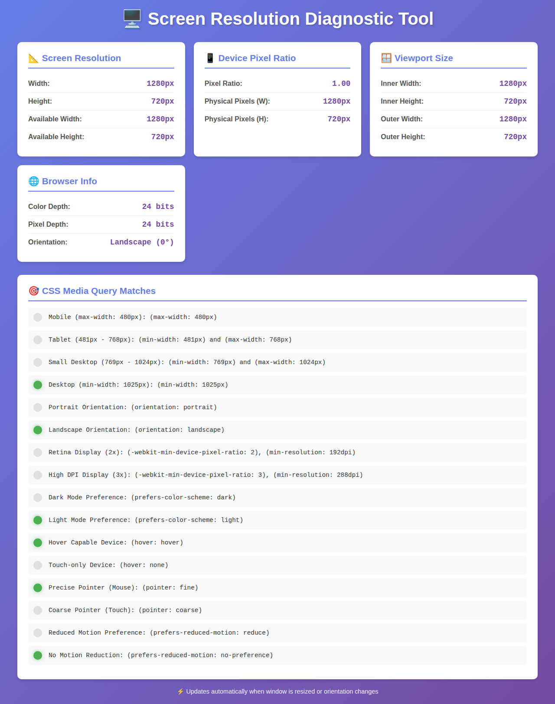
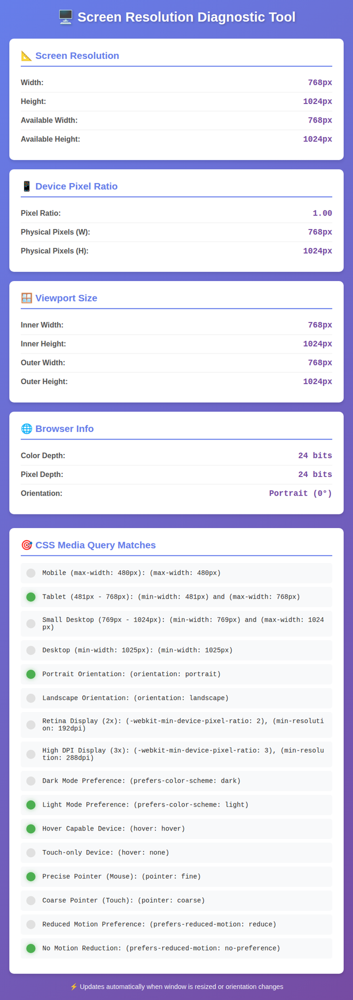
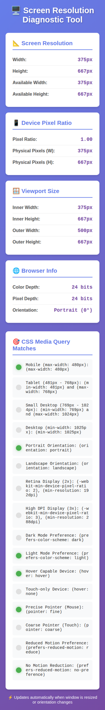

# Screen Resolution Tester

A comprehensive diagnostic tool that displays real-time information about your screen, viewport, and browser capabilities.







## Features

- 📐 **Screen Resolution**: Display actual screen dimensions and available screen space
- 📱 **Device Pixel Ratio**: Show pixel density and physical pixel calculations
- 🪟 **Viewport Size**: Track browser window dimensions (inner and outer)
- 🌐 **Browser Info**: Display color depth, pixel depth, and orientation
- 🎯 **CSS Media Query Matches**: Real-time monitoring of CSS media query states including:
  - Responsive breakpoints (mobile, tablet, desktop)
  - Screen orientation (portrait/landscape)
  - Display density (retina, high DPI)
  - User preferences (dark mode, reduced motion)
  - Input capabilities (hover, pointer type)

## Usage

Simply open `index.html` in your web browser. The diagnostic information updates automatically when:
- The browser window is resized
- The device orientation changes
- The zoom level changes

## Demo

You can use any local web server to serve the file, for example:

```bash
python3 -m http.server 8080
```

Then open `http://localhost:8080/index.html` in your browser.

## Screenshots

### Desktop View (1280x720)
The tool displays all metrics in a responsive grid layout with clear sections for each category.

### Tablet View (768x1024)
Cards stack vertically on smaller screens while maintaining readability.

### Mobile View (375x667)
Optimized single-column layout for mobile devices with all features accessible.

## Technology

Built with vanilla HTML, CSS, and JavaScript. No dependencies required.

## License

See LICENSE file for details.
